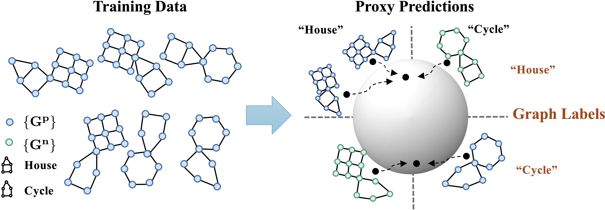

<h1 align="center">GALA: Graph invAriant Learning Assistant</h1>
<p align="center">
    <a href="https://arxiv.org/abs/2202.05441"></a>
    <a href="https://github.com/LFhase/GALA"></a>
    <!-- <a href="https://colab.research.google.com/drive/1t0_4BxEJ0XncyYvn_VyEQhxwNMvtSUNx?usp=sharing"></a> -->
    <a href="https://openreview.net/forum?id=A6AFK_JwrIW">  </a>
    <a href="https://github.com/LFhase/GALA/blob/main/LICENSE">  </a>
    <!-- <a href="https://neurips.cc/virtual/2022/poster/54643"> </a> -->
    <!-- <a href="https://lfhase.win/files/slides/CIGA.pdf"> </a> -->
   <!--  <a href="https://icml.cc/media/PosterPDFs/ICML%202022/a8acc28734d4fe90ea24353d901ae678.png"> </a> -->
</p>


This repo contains the sample code for reproducing the results of our NeurIPS 2023 paper: *[Does Invariant Graph Learning via Environment Augmentation Learn Invariance?](https://openreview.net/forum?id=EqpR9Vtt13)*, which has also been presented as ***spotlight*** at [ICLR DG](https://domaingen.github.io/). 😆😆😆

Updates:
- [ ] Camera-ready version of the paper is updated in arxiv!
- [ ] Full code and instructions will be released soon!


## Introduction

Invariant graph representation learning aims to learn the invariance among data from different environments for out-of-distribution generalization on graphs. As the graph environment partitions are usually expensive to obtain, augmenting the environment information has become the *de facto* approach. However, **<ins>the usefulness of the augmented environment information has never been verified</ins>**. In this work, we find that it is **<ins>fundamentally impossible</ins>** to learn invariant graph representations via environment augmentation without additional assumptions. Therefore, we develop a set of **<ins>minimal assumptions</ins>**, including variation sufficiency and variation consistency, for feasible invariant graph learning.


<p align="center"></p>
<p align="center"><em>Figure 1.</em> The architecture of GALA.</p>

We then propose a new framework Graph invAriant Learning Assistant (GALA). GALA incorporates an assistant model that needs to be sensitive to graph environment changes or distribution shifts. The correctness of the proxy predictions by the assistant model hence can differentiate the variations in spurious subgraphs. We show that extracting the maximally invariant subgraph to the proxy predictions provably identifies the underlying invariant subgraph for successful OOD generalization under the established minimal assumptions. Extensive experiments on 12 datasets including DrugOOD with various graph distribution shifts confirm the effectiveness of GALA

## Major Updates in GALA

GALA is an improved version of [CIGA](https://github.com/LFhase/GALA), for resolving the graph distribution shifts in the wild. The main running and code structures are the same as CIGA. Here we list the major updates in GALA compared to CIGA, thus one could easier get started with GALA:

1. Updated backbone. We use a new backbone inspired by the success of GSAT, where we use instancenorm to improve the stability of the edge attention.
2. Full compatibility with PyG v2, where the weighted message passing needs new reweighting specifications as shown in `utils/mask.py`.
3. The key difference between GALA and CIGA is that, GALA adopts a new contrastive sampling scheme with an environment assistant model. The assistant model can be obtained simply with ERM as discussed in the paper.

## Instructions

### Installation and data preparation
We run the code with cuda=10.2 and python=3.8.12, based on the following libraries:

```
torch==1.9.0
torch-geometric==2.0.4
scikit-image==0.19.1 
```

plus the [DrugOOD](https://github.com/tencent-ailab/DrugOOD) benchmark repo.

The data used in the paper can be obtained following these [instructions](./dataset_gen/README.md).

### Running example
Step 1. train a `environment assistant` model, the name is specified via `--commit` option. If `-ea` is used, the last epoch modell will be saved.
```
python3 main.py  -c_in 'raw' -c_rep 'rep'  --seed '[1,2,3,4,5]' --num_layers 3 --pretrain 100 --batch_size 128 --dataset 'tSPMotif' --bias 0.9 --r -1 --save_model --spu_coe 0. --model 'gin' --dropout 0. --commit 'last' -ea --erm 
```

Step 2. improving contrastive sampling with the environment assistant model, whose name is specified via `--commit` option:
```
python3 main.py  -c_in 'raw' -c_rep 'rep'  --seed '[1,2,3,4,5]' --num_layers 3 --pretrain 100 --batch_size 128 --dataset 'tSPMotif' --bias 0.9 --r -1 --contrast 128 --spu_coe 0 --model 'gin' --dropout 0. -c_sam gala --num_envs 3 --commit 'last' -pe 10 --ginv_opt 'ciga'
```
If `num_envs=1`, the sampling will be based on prediction correctness while if `num_envs>1`, the sampling will based on the clustering, and

<!-- ### Reproduce results
We provide the hyperparamter tuning and evaluation details in the paper and appendix.
In the below we give a brief introduction of the commands and their usage in our code. 
We provide the corresponding running scripts in the [script](./scripts/) folder.

To obtain results of ERM, simply run 
```
python main.py --erm
```
with corresponding datasets and model specifications.


Runing with GALA: -->


## Misc
If you find our paper and repo useful, please cite our paper:

```bibtex
@inproceedings{
chen2023gala,
title={Does Invariant Graph Learning via Environment Augmentation Learn Invariance?},
author={Yongqiang Chen and Yatao Bian and Kaiwen Zhou and Binghui Xie and Bo Han and James Cheng},
booktitle={Thirty-seventh Conference on Neural Information Processing Systems},
year={2023},
url={https://openreview.net/forum?id=EqpR9Vtt13}
}
```
